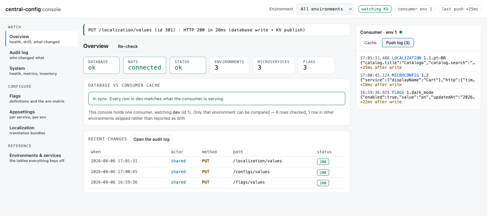
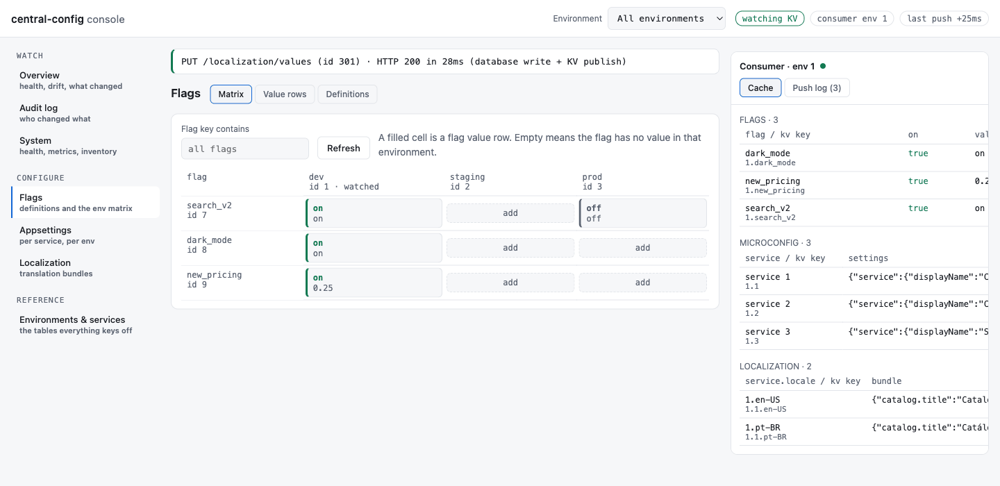
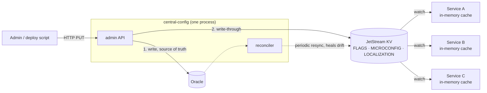

# central-config

[](LICENSE)
[](go.mod)
[](https://pkg.go.dev/github.com/ErasedKyte/Central-Config-Stream/pkg/configclient)
[](https://github.com/ErasedKyte/Central-Config-Stream/actions/workflows/ci.yml)

A control plane for microservice configuration: feature flags, per-service
appsettings, and localization bundles for a fleet of services.

A relational database is the source of truth. Every admin write is also written
through to NATS JetStream KV, which consuming services watch and cache in
memory. Consumers never call this service on the request path and never query
the database — a config read in a consumer is a field access.

> The repository is `Central-Config-Stream`; the project itself is
> `central-config` — the Go module path, the binary, the compose service and the
> default `SERVICE_NAME`. Only the repository name differs.

One concept wears several names. The per-service JSON tree is **appsettings** in
prose, `/configs` on the API, `MICROCONFIG` in KV, `microconfig` in the Go
packages, `MicroSettings()` on the client, and `SETTINGS_JSON` in the database.
They are all the same thing.

## The problem

Fleet-wide configuration has to reach running processes quickly, without every
service polling a database. Polling gives you a choice between stale config and
a database that carries the read load of the whole fleet. Pushing from the admin
API to each service directly means the admin API has to know who is running.

The split here is:

- **Control plane** — this service. An HTTP admin API backed by Oracle. Admins
  write here. Consumers never call it.
- **Data plane** — NATS JetStream KV. Consumers watch it and serve every read
  from an in-memory cache.

If the control plane or the database is down, consumers keep running on cached
values. If NATS is down after a consumer has started, values freeze at last
known good rather than erroring.

## Requirements

| what | version | why |
|---|---|---|
| **Oracle** | any supported release | The source of truth in a deployed setup. The only production driver — `DB_DRIVER=oracle` is the default, and DDL for every table is in [`migrations/`](migrations/). |
| **NATS 2.10+ with JetStream enabled** | 2.10+ | The distribution plane. KV buckets are a JetStream feature; a server without `--jetstream` cannot run this. |
| **Go 1.26+** | see [`go.mod`](go.mod) (`go 1.26`) | To build the service, the console and `pkg/configclient`. |
| **Node 20+** | see [`webui/package.json`](webui/package.json) | Only to build the React console. The service itself needs no Node. |

**SQLite is the local test stack only.** `DB_DRIVER=sqlite` swaps in a parallel
set of repositories so the JetStream path can be exercised on a laptop without
an Oracle instance. The schema is the same shape and the SQL differs only in
bind-parameter syntax, but running that stack does not exercise the Oracle
repositories at all — see [Known limitations](#known-limitations).

## Quickstart

The local stack runs the whole path on one machine: an admin write hits the HTTP
API, lands in the database, is written through to KV, and is pushed to a
consumer that serves it from memory.

```bash
docker compose -f deploy/compose/docker-compose.yml up --build
# console: http://localhost:8090   admin API: :8080   NATS: nats://localhost:4222
```

Compose builds the React console inside the image, so nothing else is needed.
**The stack seeds everything into environment 1 (`dev`)** — environments 2
(`staging`) and 3 (`prod`) exist as rows but hold almost nothing. Every example
below is environment 1.

Read the seeded flag values. Reads need a bearer token now; the stack's is
`local-dev-token`:

```bash
curl -s -H "Authorization: Bearer local-dev-token" \
  "http://localhost:8080/flags/values?environmentId=1"
```

```json
[{"id":100,"environmentId":1,"flagId":7,"flagKey":"search_v2","value":"on","enabled":1,"updatedAt":"..."},
 {"id":101,"environmentId":1,"flagId":8,"flagKey":"dark_mode","value":"off","enabled":0,"updatedAt":"..."},
 {"id":102,"environmentId":1,"flagId":9,"flagKey":"new_pricing","value":"0.25","enabled":1,"updatedAt":"..."}]
```

Now turn `dark_mode` on. `id` is the flag-value row id from the listing above:

```bash
curl -s -X PUT http://localhost:8080/flags/values \
  -H "Authorization: Bearer local-dev-token" \
  -H "Content-Type: application/json" \
  -d '{"id":101,"enabled":1,"value":"on"}'
```

```json
{"id":101,"environmentId":1,"flagId":8,"value":"on","enabled":1,"updatedAt":"2026-08-05T23:29:01Z"}
```

That request wrote Oracle (SQLite here), published KV key `FLAGS/1.dark_mode`,
and pushed it to every watching consumer. The console's own consumer has it
already:

```bash
curl -s http://localhost:8090/api/state | jq '.flags.dark_mode'
```

```json
{"enabled": true, "value": "on", "updatedAt": "2026-08-05T23:29:01Z"}
```

Note `"enabled": 1` going in and `"enabled": true` coming out — see
[the int/bool trap](#the-intbool-trap).

[`deploy/compose/README.md`](deploy/compose/README.md) is the full walkthrough:
the seeded data table, four things worth trying, and a two-terminal setup that
needs no Docker at all.

### Install

A `v*` tag publishes a container image and cross-compiled binaries; three ways
to get the same service:

```bash
# the image — linux/amd64, distroless, non-root
docker run --rm ghcr.io/erasedkyte/central-config:latest --version

# a binary — pick your platform from the release page and verify it against
# checksums.txt: https://github.com/ErasedKyte/Central-Config-Stream/releases
tar xzf central-config_0.1.0_linux_amd64.tar.gz && ./central-config --version

# from source — the module path carries the repository name, the binary does not
go install github.com/ErasedKyte/Central-Config-Stream/cmd/central-config@latest
```

The first two report a real version, because the release pipeline stamps it in.
`go install` does not pass `-ldflags`, so a binary installed that way honestly
says `dev (commit none, built unknown)` — use it for a quick look, not for
telling two deployments apart.

**The image is the service alone; it serves no browser UI.** The console is a
separate binary, and its React bundle is not in the archives — `web/` is
gitignored and building it needs Node — so an unpacked `testconsole` answers
`/api/state` and `/api/events` but tells the browser the UI has not been built.
Getting the console *with* its UI means the compose stack above, which builds
the bundle in a Node stage, or `cd webui && npm ci && npm run build` beside the
binary. [`docs/RELEASING.md`](docs/RELEASING.md) is the other side of this: how
a release is cut and how to check one landed.

Building from source:

```bash
go build ./... && go vet ./... && go test ./...
cd webui && npm ci && npm run build   # React console, writes ../web
```

## The console

`webui/` + [`cmd/testconsole`](cmd/testconsole) is a React console that plays a
consuming microservice. It holds a live `configclient` cache warmed from KV and
serves a browser UI showing that cache change as you write. It is the only
showable artefact in an otherwise headless project, and it demonstrates things
the API alone cannot:



- **Seven views.** Overview (health, drift, recent pushes), Audit log,
  System (health, metrics, inventory), Flags (definitions and an
  environment × flag matrix), Appsettings, Localization, and
  Environments & services.
- **An environment switcher** in the header that narrows every view to one
  environment, or shows all of them.
- **Live SSE push.** `GET /api/events` streams every KV update the consumer
  receives; the right-hand panel fills in as writes land, with no polling.
- **A drift panel.** The one place anything compares the database against what a
  consumer is actually serving. It reads the admin API and the consumer's cache
  and reports each disagreement — a row the consumer never received, a cached
  key with no row behind it, a value that differs. Rows outside the watched
  environment are counted as out of scope, never as drift.
- **A measured propagation latency.** A write is marked before the request goes
  out, and the KV push that follows is timestamped on arrival; the header shows
  `last push +NNms` and each event carries its own figure. It is the number that
  makes "write-through to KV" concrete.



The console proxies its admin calls so the browser never holds the token. It
binds to `127.0.0.1` by default — reaching it from another machine needs
`BIND_ADDR=0.0.0.0`, and it warns loudly when it is not on loopback, because it
attaches a full-scope admin token to everything it forwards. It checks `Origin`,
forwards only `application/json` to a named list of API paths, and — when
`web/` has not been built — serves a page telling you to build it instead of a
bare 404.

## How it works



The reconciler is not a separate deployable — it runs in-process, started by the
same binary when `PUBLISH_ENABLED=true`.

The dual write is not transactional. Oracle is written first and the KV write
follows; a KV failure is logged and does not fail the admin request. The
reconciler sweeps Oracle against KV on `RECONCILE_INTERVAL` and republishes
anything missing or stale, so drift is bounded by that interval rather than
permanent. See [`docs/PRODUCTION_READINESS.md`](docs/PRODUCTION_READINESS.md)
§3.2 for what that costs and what a transactional outbox would buy.

### Behaviour when NATS is down

The service starts and serves reads with NATS unreachable, retrying bucket
provisioning in the background on every reconcile cycle. Startup takes about
fifteen seconds longer while the first provisioning attempt times out.
`GET /health` reports `"nats":"disconnected"` and answers 503; `GET /livez`
stays 200, so an orchestrator takes the pod out of the load balancer instead of
killing it. Writes still return 200 — the database is the source of truth and
accepts them — but the KV publish fails, is logged, and is healed by the
reconciler once NATS returns.

## KV key layout

Three buckets. Keys are environment-scoped so a consumer can watch one prefix
and receive only what belongs to its environment.

| bucket | key | example (seeded env 1) |
|---|---|---|
| `FLAGS` | `{environmentId}.{flagKey}` | `1.search_v2` |
| `MICROCONFIG` | `{environmentId}.{microserviceId}` | `1.1` |
| `LOCALIZATION` | `{environmentId}.{microserviceId}.{locale}` | `1.1.pt-BR` |

Values:

- `FLAGS` — `{"enabled": true, "value": "0.25", "updatedAt": "..."}`. `value` is
  a free-form string, used for things like rollout percentages.
- `MICROCONFIG` — the entire appsettings tree as one JSON document, so one push
  replaces it atomically and a consumer can never observe half an update.
- `LOCALIZATION` — one JSON object per locale: `{"catalog.title": "..."}`.

Buckets keep five historical values per key, which is the rollback depth, and a
single value may not exceed **512 KiB**. The admin API enforces the same ceiling
before the database write and answers 400 (`settings json exceeds the maximum
value size`), so a payload can never be accepted with a 201 and then refused by
JetStream forever afterwards.

**No secrets in KV.** Anyone with NATS credentials can read every key, and every
consumer holds it in plaintext memory. The convention is that secret-shaped
fields carry a marker instead of a value — `"accessKeyId": "env:STORAGE_ACCESS_KEY_ID"`
— which the consumer resolves at bind time from its own secret store. The seeded
example document in [`internal/database/sqlite.go`](internal/database/sqlite.go)
demonstrates the shape.

## Admin API

**Every route except `GET /health`, `GET /livez` and `GET /metrics` requires a
bearer token.** Reads used to be anonymous; they are not any more, because a
single unauthenticated GET was enough to walk off with every appsettings tree
and bundle in the estate.

Writes are additionally rate-limited per caller (`WRITE_RATE_LIMIT_PER_MINUTE`,
default 120) and recorded in an audit log with the actor, the target and a
redacted request body.

### Token scope narrows reads as well as writes

`ADMIN_TOKENS=ci-dev:1|2:secret` gives a token the environments 1 and 2. That
scope applies in both directions:

- **Writes** to any other environment answer **403**.
- **Listings** (`/flags/values`, `/configs/values`, `/localization`,
  `/environments`) return only rows in environments 1 and 2.
- **`GET /inventory`** and **`GET /audit`** are narrowed the same way; audit
  rows that carry no environment at all are invisible to a scoped token.
- **A single row fetched by id** that lives outside the scope answers **404**,
  not 403 — any other answer would confirm it exists.

`ADMIN_TOKEN` (singular) is the shared full-scope form, recorded as the actor
`shared`. With neither variable set, auth is disabled and the service warns at
startup — dev only.

### Routes

```
GET  /health      readiness: pings the database AND reports NATS; 503 if either is down
GET  /livez       liveness: static, touches no dependency
GET  /metrics     Prometheus: publish success/failure, reconcile drift, HTTP

GET  /inventory   every editable row with its id — paged, ?limit (default 100, max 500) &offset
GET  /audit       the write audit trail — ?actor=&from=&to=&limit=&offset=

GET    /environments                 ?limit=&offset=
POST   /environments
DELETE /environments/{id}

GET    /microservices                ?limit=&offset=
POST   /microservices
DELETE /microservices/{id}

GET    /configs/{id}                 the microservice definition (belongs to no environment)
GET    /configs/values               ?microserviceId=&environmentId=&limit=&offset=
GET    /configs/values/{id}
POST   /configs/values
PUT    /configs/values               the id goes in the body, not the path
DELETE /configs/values/{id}

GET    /flags                        ?flagKey=&limit=&offset=
GET    /flags/{id}
POST   /flags
DELETE /flags/{id}

GET    /flags/values                 ?environmentId=&flagKey=&limit=&offset=
GET    /flags/values/{id}
POST   /flags/values
PUT    /flags/values                 the id goes in the body, not the path
DELETE /flags/values/{id}

GET    /localization                 ?microserviceId=&environmentId=&locale=&limit=&offset=
GET    /localization/{id}
GET    /localization/lookup/{msId}/{envId}/{locale}
POST   /localization
PUT    /localization/values          the id goes in the body, not the path
DELETE /localization/{id}
```

Two shapes to note. `DELETE` is registered on `/{id}` only — there is no delete
on a collection path. And localization is the odd one out: it creates at
`/localization` and deletes at `/localization/{id}`, but updates at
`/localization/values`.

Every response carries `X-Content-Type-Options: nosniff`, and
`Strict-Transport-Security` when the connection is really TLS. When
`TLS_CERT_FILE`/`TLS_KEY_FILE` are set the server floor is **TLS 1.3** — nothing
in the stack (browsers, the console proxy, the Go client, Prometheus) needs 1.2
kept open.

### Writing

Creating an appsettings row and a bundle, against the local stack:

```bash
curl -s -X POST http://localhost:8080/configs/values \
  -H "Authorization: Bearer local-dev-token" \
  -H "Content-Type: application/json" \
  -d '{"microserviceId":2,"environmentId":2,"settingsJson":{"http":{"timeoutMs":1500}}}'
# 201 {"id":203,"microserviceId":2,"environmentId":2,"settingsJson":{...},"updatedAt":"..."}

curl -s -X POST http://localhost:8080/localization \
  -H "Authorization: Bearer local-dev-token" \
  -H "Content-Type: application/json" \
  -d '{"microserviceId":1,"environmentId":2,"locale":"en-US","bundleJson":{"catalog.title":"Catalog"}}'
# 201 {"id":302,"microserviceId":1,"environmentId":2,"locale":"en-US","bundleJson":{...},"updatedAt":"..."}
```

`settingsJson` and `bundleJson` must be JSON **objects** — a top-level array or
scalar is well-formed JSON that would break every consumer's deserialization at
once, so it is refused with 400.

### Optimistic concurrency

Every `PUT` accepts an optional `expectedUpdatedAt`. The write applies only
while the stored row still carries that timestamp; otherwise it answers **409**
and changes nothing. Absent, the original last-write-wins behaviour stands. It
is implemented and tested in all three domains — flag values, appsettings and
bundles — against both the Oracle and SQLite repositories.

```bash
# read the row, keep its updatedAt
curl -s -H "Authorization: Bearer local-dev-token" \
  http://localhost:8080/flags/values/101
# {"id":101,...,"updatedAt":"2026-08-05T23:27:56Z"}

# a stale timestamp loses the race
curl -s -o /dev/null -w '%{http_code}\n' -X PUT http://localhost:8080/flags/values \
  -H "Authorization: Bearer local-dev-token" \
  -H "Content-Type: application/json" \
  -d '{"id":101,"enabled":0,"value":"off","expectedUpdatedAt":"2020-01-01T00:00:00Z"}'
# 409
```

### The int/bool trap

`enabled` is an **integer** on the admin API and a **boolean** in KV. Same
concept, two types, because the API mirrors the `NUMBER`/`INTEGER` column and KV
mirrors what a consumer wants to branch on:

| plane | shape |
|---|---|
| `POST`/`PUT` `/flags/values` request, and every API response | `"enabled": 1` / `"enabled": 0` |
| `GET /inventory` | `"enabled": 1` / `"enabled": 0` |
| KV value in `FLAGS`, and `configclient.FlagPayload` | `"enabled": true` / `"enabled": false` |

The conversion is `Enabled != 0`, done once on the publish path. A tool that
reads a flag value from the API and writes it back unchanged is fine; a tool
that reads from KV and posts what it found is not.

## Integrating a consumer

**Go** — import [`pkg/configclient`](pkg/configclient):

```go
c, err := configclient.New(ctx, configclient.Options{
    NATSURL:        "nats://nats.example.internal:4222",
    EnvironmentID:  1, // the environment the local stack seeds
    MicroserviceID: 1, // scopes the watch to this service's own keys
})
if err != nil {
    return fmt.Errorf("configclient: %w", err)
}
defer c.Close()

if c.FlagEnabled("search_v2") { ... }              // true in the seeded env 1
raw, ok := c.MicroSettings(1)                       // catalog-api's appsettings tree
text, ok := c.Translate(1, "pt-BR", "catalog.title") // "Catálogo"
```

Check the error before the `defer`: on failure `c` is nil and `c.Close()`
panics.

`New` blocks until the initial values for the client's scope are loaded, so a
service does not start serving on an empty cache — that is how a "feature
disabled everywhere" incident happens. Reads after that are memory accesses.
Setting `MicroserviceID` matters: without it the client caches every service's
configuration in the process, and `Status().FleetWide` reports that it did.

`Options.HTTPFallback` is an optional cold-start path: if JetStream is
unreachable at boot it hydrates what it can over the admin API instead of
booting with no config at all. It runs only from `New`, never from a read.
Because every admin route now needs a credential, it requires
`HTTPFallback.Token` — scoped to the same environment as the client, since a
read outside a token's scope answers 404 like a row that does not exist.
`AllowUnauthenticated` exists for a deployment running with auth switched off,
which is dev only.

**Any other language** — there is no shipped client, but the consumer contract
is small and fully specified in
[`docs/CONSUMER_CONTRACT.md`](docs/CONSUMER_CONTRACT.md): what to watch, what
the values look like, how to gate startup, why the watch handler must be
idempotent, how to resolve the secret markers, and how to test the whole loop
against the local stack.

## Configuration

Entirely environment-driven. [`.env.example`](.env.example) documents every
variable both binaries read, with its default in brackets — read it rather than
guessing. The service auto-loads a `.env` file at startup via `godotenv.Load()`;
**the test console does not**, so its variables have to be exported or set on
the command line.

Beyond the obvious `DB_DRIVER` / `CONN_STRING` / `NATS_URL` / `PUBLISH_ENABLED`:

| variable | what it bounds |
|---|---|
| `DB_MAX_OPEN_CONNS` `[20]`, `DB_MAX_IDLE_CONNS` `[5]` | Oracle sessions this process may hold. Left unbounded, a slow query plus replicas plus the reconciler can exhaust a shared instance. Not applied to SQLite, which runs on one connection. |
| `DB_CONN_MAX_LIFETIME` `[30m]`, `DB_CONN_MAX_IDLE_TIME` `[5m]` | How long a session lives and how long an idle one is kept. Without a lifetime, a session survives a failover as a half-dead connection. |
| `RECONCILE_PRUNE_MAX_FRACTION` `[0.2]` | The share of a KV bucket one reconcile cycle may delete. A database that came back empty would otherwise have the reconciler purge the whole fleet's configuration. |
| `WRITE_RATE_LIMIT_PER_MINUTE` `[120]` | Writes per caller per minute; `<= 0` disables it. |
| `TLS_CERT_FILE`, `TLS_KEY_FILE` | Both set ⇒ HTTPS with a TLS 1.3 floor and HSTS. Otherwise plain HTTP with a startup warning. |

Console-only: `BIND_ADDR` `[127.0.0.1]`, `ALLOWED_ORIGINS`, `ENVIRONMENT_ID`
`[1]`, `CENTRAL_CONFIG_URL`, `NATS_EMBEDDED` `[false]`, `WEB_DIR` `[web]`.

`ADMIN_TOKENS` is `NAME:ENV_SCOPE:SECRET`, comma separated. A **name** is
limited to `[A-Za-z0-9._-]` and 100 characters, and a **secret may not contain a
comma** — entries are split on commas before they are split on colons, so a
comma inside a secret silently starts an entry, and possibly a full-scope token,
of its own. The name check is what catches that at startup rather than in
production.

## Documentation

Read in this order: the compose walkthrough to see it work, the consumer
contract to integrate against it, then security and production readiness before
deploying it.

| file | what it covers |
|---|---|
| [`deploy/compose/README.md`](deploy/compose/README.md) | the local stack: seeded data, what to try, and a Docker-free two-terminal setup |
| [`docs/CONSUMER_CONTRACT.md`](docs/CONSUMER_CONTRACT.md) | the consumer contract — what to watch, value shapes, caching semantics, in any language |
| [`docs/openapi.yaml`](docs/openapi.yaml) | the admin API as OpenAPI 3.1 — every route above, the schema each carries, and which failure answers with what |
| [`docs/SECURITY.md`](docs/SECURITY.md) | auth model, token scoping, secret handling, threat notes |
| [`docs/DEPLOY_JETSTREAM_K8S.md`](docs/DEPLOY_JETSTREAM_K8S.md) | deploying NATS JetStream and this service on Kubernetes |
| [`docs/OBSERVABILITY.md`](docs/OBSERVABILITY.md) | ECS log shape, metrics, what to alert on |
| [`docs/PRODUCTION_READINESS.md`](docs/PRODUCTION_READINESS.md) | current gaps, honestly listed |
| [`CONTRIBUTING.md`](CONTRIBUTING.md) | how to build, test and lint, and the ~45 sites a new config domain touches |
| [`docs/RELEASING.md`](docs/RELEASING.md) | cutting a release: finalising the changelog, tagging, and checking what the tag produced |
| [`SECURITY.md`](SECURITY.md) | how to report a vulnerability, and what is in scope |
| [`CODE_OF_CONDUCT.md`](CODE_OF_CONDUCT.md) | what taking part here asks of everyone, and the private channel for reporting a problem |
| [`CHANGELOG.md`](CHANGELOG.md) | what each release changed, written as capability rather than commit history |

Oracle DDL for every table is in [`migrations/`](migrations/).

## Known limitations

- **The dual write is not transactional.** A crash between the Oracle commit and
  the KV write leaves KV stale until the next reconcile. Bounded by
  `RECONCILE_INTERVAL`, not eliminated. A transactional outbox would close it
  and is deliberately not built — see
  [`docs/PRODUCTION_READINESS.md`](docs/PRODUCTION_READINESS.md) §3.2.
- **No repository-layer tests against Oracle.** The Oracle SQL is exercised only
  by compilation; the end-to-end tests run against SQLite.
- **KV has no per-key ACLs out of the box.** With a single shared credential,
  any consumer holding it can read every environment's keys. The environment
  prefix is a scoping convention for watches, not an access control boundary.
  This is why secrets must not be in KV;
  [`docs/SECURITY.md`](docs/SECURITY.md) has the NATS permission model that
  narrows it.
- **TLS is opt-in.** With `TLS_CERT_FILE`/`TLS_KEY_FILE` unset the admin API
  serves plain HTTP and warns at startup, on the assumption that TLS terminates
  at an ingress.
- **The HTTP cold-start fallback cannot rehydrate flags on its own.** There is
  no "list flag values for environment X" route, so
  `HTTPFallback.FlagValueIDs` has to name the row ids by hand. What is left
  unconfigured is simply not fetched.

## Licence

MIT — see [LICENSE](LICENSE).
