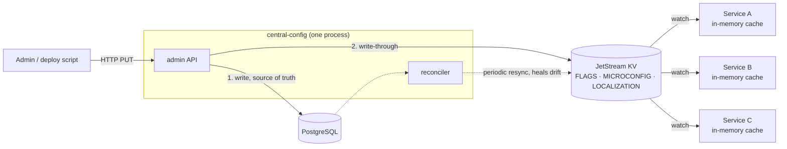

# central-config

[](LICENSE)
[](go.mod)
[](https://pkg.go.dev/github.com/AliAladraj/Central-Config-Stream/pkg/configclient)
[](https://github.com/AliAladraj/Central-Config-Stream/actions/workflows/ci.yml)

Realtime configuration for a fleet of services. Change a feature flag, a
service's settings, or a translation in one place, and every running service
sees it within milliseconds — no polling, no restart, no redeploy.


## Why I built this

I wanted the realtime part of Firebase — change a value, and every connected
client sees it instantly. But Firebase is a paid, hosted service, and I didn't
want that dependency or that bill. What I actually needed the realtime sync
*for* was configuration: feature flags, per-service settings, localization. So
I built that piece myself, on open-source parts I can self-host: PostgreSQL as
the source of truth, NATS JetStream to push changes out, and a small Go client
that keeps every value in memory.

To be clear about scope: this is **not** a general Firebase replacement. There
are no mobile SDKs, no per-user data, no offline sync. It does one thing — get
configuration from an admin API into the memory of every running service,
fast — and it aims to do that one thing well.

## How it works, in one paragraph

You write to an HTTP admin API. The write lands in PostgreSQL (the source of
truth) and is immediately pushed to NATS JetStream KV. Your services watch KV
and keep every value in an in-memory cache — so a config read in your service
is just a field access. Your services never call the admin API and never touch
the database. If the admin API or the database goes down, services keep running
on their cached values. If NATS goes down, values freeze at last known good
instead of erroring.



One honest detail up front: the database write and the KV push are **not one
transaction**. If the process crashes between them, KV is stale until the
built-in reconciler resyncs it (every `RECONCILE_INTERVAL`). Drift is bounded,
not impossible. [`docs/PRODUCTION_READINESS.md`](docs/PRODUCTION_READINESS.md)
§3.2 covers what a transactional outbox would buy and why it isn't built yet.

## Try it in two minutes

```bash
docker compose -f deploy/compose/docker-compose.yml up --build
# console: http://localhost:8090   admin API: :8080   NATS: nats://localhost:4222
```

The stack seeds demo data into environment 1 (`dev`). Read the seeded flags
(the local token is `local-dev-token`):

```bash
curl -s -H "Authorization: Bearer local-dev-token" \
  "http://localhost:8080/flags/values?environmentId=1"
```

Flip `dark_mode` on (`id` 101 comes from that listing):

```bash
curl -s -X PUT http://localhost:8080/flags/values \
  -H "Authorization: Bearer local-dev-token" \
  -H "Content-Type: application/json" \
  -d '{"id":101,"enabled":1,"value":"on"}'
```

That one request wrote the database, published KV key `FLAGS/1.dark_mode`, and
pushed it to every watching consumer. The console's own consumer already has
it:

```bash
curl -s http://localhost:8090/api/state | jq '.flags.dark_mode'
# {"enabled": true, "value": "on", "updatedAt": "..."}
```

Watch the console header while you do this — it shows `last push +NNms`, the
measured time from your write to the value landing in the consumer's memory.

Note `"enabled": 1` going in and `"enabled": true` coming out — that's
deliberate, see [the int/bool trap](#the-intbool-trap).
[`deploy/compose/README.md`](deploy/compose/README.md) is the full walkthrough,
including a two-terminal setup that needs no Docker.

## Install

```bash
# container image (linux/amd64 + arm64), service only — no browser UI inside
docker pull ghcr.io/alialadraj/central-config:0.1.1   # :latest also works

# prebuilt binaries — see the releases page for darwin/linux tarballs
# checksums.txt covers all eight archives, so check just the one you grabbed:
#   sha256sum --ignore-missing -c checksums.txt   (macOS: shasum -a 256 --ignore-missing -c)

# from source — @main, because now that tags exist @latest means the newest tag
go install github.com/AliAladraj/Central-Config-Stream/cmd/central-config@main
```

A source-built binary reports `--version` as `dev` — only `make build` and the
release pipeline stamp real version info in. The console UI is not in the image
or the tarballs: run the compose stack, or build it yourself with
`cd webui && npm ci && npm run build`. [`docs/RELEASING.md`](docs/RELEASING.md)
covers how releases are cut and verified.

## Requirements

| what | version | why |
|---|---|---|
| PostgreSQL | any supported release; CI runs 17 | Source of truth. `DB_DRIVER=postgres` is the default; DDL is in [`migrations/`](migrations/). |
| NATS | 2.10+, JetStream enabled | The distribution plane. KV buckets need `--jetstream`. |
| Go | 1.26+ | To build the service, console, and client. |
| Node | 20.19+ or 22.12+ | Only to build the React console. |

SQLite (`DB_DRIVER=sqlite`) exists so the whole stack runs on a laptop with no
PostgreSQL — it's for local use and tests, not deployment. The PostgreSQL code
paths have their own CI suite (`internal/pgintegration`) against a real server.

## The console

`webui/` + [`cmd/testconsole`](cmd/testconsole) is a React console that plays
the role of a consuming service: it holds a live `configclient` cache and shows
it change as you write. Seven views — overview, audit log, system, flags (with
an environment × flag matrix), appsettings, localization, and environments —
plus three things the API alone can't show you:

- **Live push.** An SSE stream fills the right-hand panel as KV updates land.
  No polling.
- **A drift panel.** It compares the database against what the consumer is
  actually serving and reports every disagreement.
- **Measured latency.** Each write is timed to the KV push that follows;
  `last push +NNms` in the header is the number that makes "realtime" concrete.


Security, short version: the console proxies admin calls so the browser never
holds the token, binds to `127.0.0.1` by default and warns loudly when it
doesn't, and checks the `Host` header against an allowlist before trusting
`Origin` — because `Origin` alone is defeated by DNS rebinding. Reaching it
from another machine needs both a wider bind (`BIND_ADDR`) and the name listed
in `ALLOWED_HOSTS`; otherwise it answers 403.

## Using it from your service

**Go** — import [`pkg/configclient`](pkg/configclient):

```go
c, err := configclient.New(ctx, configclient.Options{
    NATSURL:        "nats://nats.example.internal:4222",
    EnvironmentID:  1,
    MicroserviceID: 1, // scopes the watch to this service's own keys
})
if err != nil {
    return fmt.Errorf("configclient: %w", err)
}
defer c.Close() // check err first — on failure c is nil and Close panics

if c.FlagEnabled("search_v2") { ... }
raw, ok := c.MicroSettings(1)
text, ok := c.Translate(1, "pt-BR", "catalog.title")
```

`New` blocks until the client's initial values are loaded, so a service never
starts serving on an empty cache. After that, every read is a memory access.
`Options.HTTPFallback` optionally hydrates over the admin API at cold start if
JetStream is unreachable — it needs a token scoped to the same environment.

**Any other language** — the consumer contract is small and fully specified in
[`docs/CONSUMER_CONTRACT.md`](docs/CONSUMER_CONTRACT.md): what to watch, what
the values look like, and how to test against the local stack.

## The data plane: KV layout

Three buckets, keys scoped by environment so a consumer can watch one prefix:

| bucket | key | value |
|---|---|---|
| `FLAGS` | `{envId}.{flagKey}` | `{"enabled": true, "value": "0.25", "updatedAt": "..."}` |
| `MICROCONFIG` | `{envId}.{microserviceId}` | the whole appsettings tree as one JSON document — one push replaces it atomically |
| `LOCALIZATION` | `{envId}.{microserviceId}.{locale}` | one JSON object per locale |

Each key keeps five historical values (the rollback depth) and a value may not
exceed **512 KiB** — the API enforces the same ceiling with a 400, so nothing
gets accepted and then refused by JetStream later.

**Never put secrets in KV.** Anyone with NATS credentials can read every key.
The convention: secret-shaped fields carry a marker —
`"accessKeyId": "env:STORAGE_ACCESS_KEY_ID"` — which each consumer resolves
from its own secret store.

## The admin API

Every route except `/health`, `/livez` and `/metrics` requires a bearer token.
Writes are rate-limited per caller and recorded in an audit log with the actor
and a redacted body.

**Token scope cuts both ways.** `ADMIN_TOKENS=ci-dev:1|2:secret` gives a token
environments 1 and 2: writes elsewhere answer 403, listings only return rows it
can see, and a single row fetched by id from outside the scope answers **404**,
not 403 — any other answer would confirm the row exists. `ADMIN_TOKEN`
(singular) is the shared full-scope form. With neither set, auth is off and the
service warns at startup — dev only.

The full API — every route, every schema, every error shape — is
[`docs/openapi.yaml`](docs/openapi.yaml). The quirks worth knowing before you
integrate:

- **`PUT` carries the id in the body**, not the path, on `/flags/values`,
  `/configs/values` and `/localization/values`.
- **Localization is the odd one out**: create at `/localization`, update at
  `/localization/values`, delete at `/localization/{id}`.
- **`settingsJson` / `bundleJson` must be JSON objects.** A top-level array or
  scalar would break every consumer's deserialization at once, so it's a 400.
- **Flag values**: `value` non-empty, at most 4000 characters; `enabled` must
  be exactly `0` or `1`.
- **Optimistic concurrency**: every `PUT` accepts an optional
  `expectedUpdatedAt`; if the row changed since, the write answers **409** and
  does nothing. Omit it and last-write-wins stands.

<details>
<summary>All routes at a glance</summary>

```
GET  /health      readiness: pings the database AND reports NATS; 503 if either is down
GET  /livez       liveness: static, touches no dependency
GET  /metrics     Prometheus: publish success/failure, reconcile drift, HTTP

GET  /inventory   every editable row with its id — paged, rate-limited
GET  /audit       the write audit trail — ?actor=&from=&to=&limit=&offset=

GET/POST         /environments        DELETE /environments/{id}
GET/POST         /microservices       DELETE /microservices/{id}

GET              /configs/{id}
GET/POST/PUT     /configs/values      GET/DELETE /configs/values/{id}
GET/POST         /flags               GET/DELETE /flags/{id}
GET/POST/PUT     /flags/values        GET/DELETE /flags/values/{id}
GET/POST         /localization        GET/DELETE /localization/{id}
PUT              /localization/values
GET              /localization/lookup/{msId}/{envId}/{locale}
```

Listings page with `?limit` (default 100, max 500) `&offset`. `DELETE` exists
only on `/{id}` paths.
</details>

### The int/bool trap

`enabled` is an **integer** on the API (`0`/`1`, mirroring the database column)
and a **boolean** in KV (`true`/`false`, what a consumer branches on). The
conversion happens once, on the publish path. A tool that reads from the API
and writes back to the API is fine; a tool that reads from KV and posts what it
found is not.

## Configuration

Everything is environment-driven. [`.env.example`](.env.example) documents
every variable with its default — read that rather than guessing. The service
auto-loads `.env`; the console does not.

Two that deserve a warning here: `ADMIN_TOKENS` is `NAME:ENV_SCOPE:SECRET`,
comma-separated — a malformed value is a **fatal startup error**, on purpose,
because the failure mode of parsing it leniently is a silently created
full-scope token. And `RECONCILE_PRUNE_MAX_FRACTION` (default 0.2) caps how
much of a KV bucket one reconcile cycle may delete, so a database that comes
back empty can't have the reconciler purge the whole fleet's configuration.

## Documentation

Read in this order: the compose walkthrough to see it work, the consumer
contract to integrate, then security and production readiness before deploying.

| file | what it covers |
|---|---|
| [`deploy/compose/README.md`](deploy/compose/README.md) | the local stack: seeded data, things to try, a Docker-free setup |
| [`docs/CONSUMER_CONTRACT.md`](docs/CONSUMER_CONTRACT.md) | the consumer contract, in any language |
| [`docs/openapi.yaml`](docs/openapi.yaml) | the admin API as OpenAPI 3.1 |
| [`docs/SECURITY.md`](docs/SECURITY.md) | auth model, token scoping, secret handling |
| [`docs/DEPLOY_JETSTREAM_K8S.md`](docs/DEPLOY_JETSTREAM_K8S.md) | deploying on Kubernetes |
| [`docs/OBSERVABILITY.md`](docs/OBSERVABILITY.md) | log shape, metrics, what to alert on |
| [`docs/PRODUCTION_READINESS.md`](docs/PRODUCTION_READINESS.md) | current gaps, honestly listed |
| [`docs/RELEASING.md`](docs/RELEASING.md) | how releases are cut and verified |
| [`CONTRIBUTING.md`](CONTRIBUTING.md) | building, testing, and adding a config domain |
| [`SECURITY.md`](SECURITY.md) | reporting a vulnerability |
| [`CHANGELOG.md`](CHANGELOG.md) | what each release changed |

> Naming, once: the repository is `Central-Config-Stream`; the project, module
> path, binary and compose service are all `central-config`. And the
> per-service JSON tree is called **appsettings** in prose, `/configs` on the
> API, `MICROCONFIG` in KV and `MicroSettings()` on the client — all the same
> thing.

## Known limitations

I keep this list current on purpose — it's cheaper to read than to discover.

- **The dual write is not transactional.** A crash between the database commit
  and the KV push leaves KV stale until the next reconcile. Bounded, not
  eliminated.
- **PostgreSQL is newly adopted and has never carried a production
  deployment.** CI exercises it against a real server, but treat a first
  deployment accordingly.
- **There is no migration runner.** `migrations/` is numbered DDL you apply
  yourself; nothing tracks what's applied and there's no down path.
- **Most tests above the repository layer run on SQLite.** The PostgreSQL
  integration suite covers the repositories and the token-scoping path
  end-to-end; the rest of the wiring is verified against the mirror schema.
- **KV has no per-key ACLs out of the box.** The environment prefix scopes
  watches; it is not an access-control boundary. This is why secrets stay out
  of KV — [`docs/SECURITY.md`](docs/SECURITY.md) has the NATS permission model
  that narrows it.
- **TLS is opt-in**, on the assumption it terminates at an ingress. Unset, the
  API serves plain HTTP and warns at startup.
- **The HTTP cold-start fallback fetches flags by row id**, one at a time, so
  `HTTPFallback.FlagValueIDs` must name them by hand. Fixing this is a client
  change, not a new server route.

## Licence

MIT — see [LICENSE](LICENSE).
