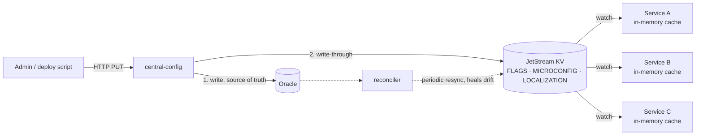

# central-config

A control plane for microservice configuration: feature flags, per-service
appsettings, and localization bundles for a fleet of services.

A relational database is the source of truth. Every admin write is also written
through to NATS JetStream KV, which consuming services watch and cache in
memory. Consumers never call this service on the request path and never query
the database — a config read in a consumer is a field access.

## The problem

Fleet-wide configuration has to reach running processes quickly, without every
service polling a database. Polling gives you a choice between stale config and
a database that carries the read load of the whole fleet. Pushing from the admin
API to each service directly means the admin API has to know who is running.

The split here is:

- **Control plane** — this service. An HTTP admin API backed by Oracle. Admins
  write here. Consumers never call it.
- **Data plane** — NATS JetStream KV. Consumers watch it and serve every read
  from an in-memory cache.

If the control plane or the database is down, consumers keep running on cached
values. If NATS is down after a consumer has started, values freeze at last
known good rather than erroring.



The dual write is not transactional. Oracle is written first and the KV write
follows; a KV failure is logged and does not fail the admin request. A
background reconciler sweeps Oracle against KV on an interval and republishes
anything missing or stale, so drift is bounded by the reconcile interval rather
than permanent. See `docs/PRODUCTION_READINESS.md` §3.2 for what that costs and
what a transactional outbox would buy.

## KV key layout

Three buckets. Keys are environment-scoped so a consumer can watch one prefix
and receive only what belongs to its environment.

| bucket | key | example |
|---|---|---|
| `FLAGS` | `{environmentId}.{flagKey}` | `3.search_v2` |
| `MICROCONFIG` | `{environmentId}.{microserviceId}` | `3.1` |
| `LOCALIZATION` | `{environmentId}.{microserviceId}.{locale}` | `3.1.pt-BR` |

Values:

- `FLAGS` — `{"enabled": true, "value": "0.25", "updatedAt": "..."}`. `value` is
  a free-form string, used for things like rollout percentages.
- `MICROCONFIG` — the entire appsettings tree as one JSON document, so one push
  replaces it atomically and a consumer can never observe half an update.
- `LOCALIZATION` — one JSON object per locale: `{"catalog.title": "..."}`.

Buckets keep five historical values per key, which is the rollback depth.

**No secrets in KV.** Anyone with NATS credentials can read every key, and every
consumer holds it in plaintext memory. The convention is that secret-shaped
fields carry a marker instead of a value — `"accessKeyId": "env:STORAGE_ACCESS_KEY_ID"`
— which the consumer resolves at bind time from its own secret store. The seeded
example document in `internal/database/sqlite.go` demonstrates the shape.

## Running the local stack

The stack runs the whole path on one machine: an admin write hits the HTTP API,
lands in the database, is written through to KV, and is pushed to a consumer
that serves it from memory. A React console shows that consumer's live cache and
the measured delay on every push.

```bash
docker compose -f deploy/compose/docker-compose.yml up --build
# console: http://localhost:8090   admin API: :8080   NATS: nats://localhost:4222
```

The stack uses SQLite, not Oracle (`DB_DRIVER=sqlite`). The schema is the same
shape and the SQL differs only in bind-parameter syntax, but running the stack
does not exercise the Oracle repositories at all. See `deploy/compose/README.md`
for what to try and for the two-terminal setup that needs no Docker.

Building from source:

```bash
go build ./... && go vet ./... && go test ./...
cd webui && npm install && npm run build   # React console, builds to web/
```

Configuration is entirely environment-driven; `.env.example` documents every
variable the service and the test console read.

## Integrating a consumer

**Go** — import `pkg/configclient`:

```go
c, err := configclient.New(ctx, configclient.Options{
    NATSURL:        "nats://nats.example.internal:4222",
    EnvironmentID:  3,
    MicroserviceID: 1, // scopes the watch to this service's own keys
})
defer c.Close()

if c.FlagEnabled("search_v2") { ... }
raw, ok := c.MicroSettings(1)
text, ok := c.Translate(1, "pt-BR", "catalog.title")
```

`New` blocks until the initial values for the client's scope are loaded, so a
service does not start serving on an empty cache — that is how a "feature
disabled everywhere" incident happens. Reads after that are memory accesses.
Setting `MicroserviceID` matters: without it the client caches every service's
configuration in the process.

**Any other language** — there is no shipped client, but the consumer contract is
small and fully specified in `docs/CONSUMER_CONTRACT.md`: what to watch, what the
values look like, how to gate startup, why the watch handler must be idempotent,
how to resolve the secret markers, and how to test the whole loop against the
local stack.

## Admin API

Reads are open. Writes require a bearer token and are rate-limited per caller.
Tokens can be scoped to a set of environments, so a CI token for dev and staging
cannot reach production. Every write is recorded in an audit log with the actor,
the target, and a redacted request body.

```
GET  /health          liveness + NATS connectivity (503 when NATS is down)
GET  /metrics         Prometheus: publish success/failure, reconcile drift, HTTP
GET  /inventory       every editable row with its id
GET  /audit           the write audit trail (requires a token)

GET|POST|DELETE      /environments, /microservices, /flags, /localization
GET|POST|PUT|DELETE  /flags/values, /configs/values
PUT                  /localization/values
```

Oracle DDL for every table is in `migrations/`.

## Documentation

| file | what it covers |
|---|---|
| `docs/CONSUMER_CONTRACT.md` | the consumer contract — what to watch, value shapes, caching semantics, in any language |
| `docs/DEPLOY_JETSTREAM_K8S.md` | deploying NATS JetStream and this service on Kubernetes |
| `docs/SECURITY.md` | auth model, token scoping, secret handling, threat notes |
| `docs/OBSERVABILITY.md` | ECS log shape, metrics, what to alert on |
| `docs/PRODUCTION_READINESS.md` | current gaps, honestly listed |

## Known limitations

- **The dual write is not transactional.** A crash between the Oracle commit and
  the KV write leaves KV stale until the next reconcile. Bounded by
  `RECONCILE_INTERVAL`, not eliminated. A transactional outbox would close it
  and is deliberately not built — see `docs/PRODUCTION_READINESS.md` §3.2.
- **No repository-layer tests against Oracle.** The Oracle SQL is exercised only
  by compilation; the end-to-end tests run against SQLite.
- **KV has no per-key ACLs out of the box.** With a single shared credential,
  any consumer holding it can read every environment's keys. The environment
  prefix is a scoping convention for watches, not an access control boundary.
  This is why secrets must not be in KV; `docs/SECURITY.md` has the NATS
  permission model that narrows it.
- **TLS is opt-in.** With `TLS_CERT_FILE`/`TLS_KEY_FILE` unset the admin API
  serves plain HTTP and warns at startup, on the assumption that TLS terminates
  at an ingress.
- **No CI pipeline is checked in.** Build, vet, and test are run by hand.

## Licence

MIT — see [LICENSE](LICENSE).
